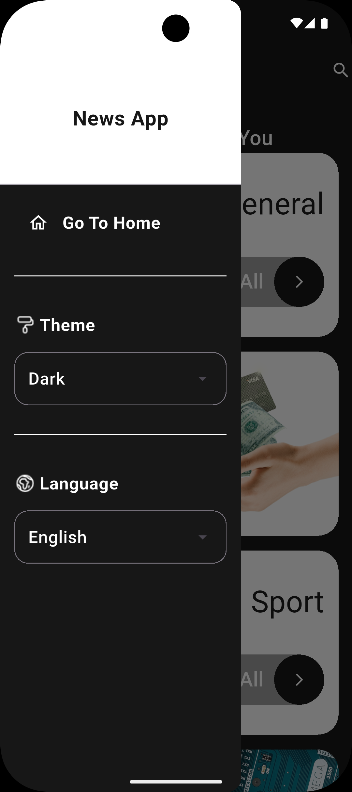

# 📰 News — Flutter News Reader App

A cross‑platform news reader built with Flutter. It pulls live headlines from [NewsAPI.org](https://newsapi.org/), lets you browse by category, switch between news sources for that category, search across all articles, and read the full story in an in‑app browser. The UI supports both light and dark themes.

> **Note:** This README was generated by analyzing the project's source code (`pubspec.yaml`, `lib/`, platform folders, etc.), since the repository didn't yet have a project‑specific README — only the default one Flutter generates for new projects.

---

## 📸 Screenshots

| Home (Light) | Home (Dark) | App Drawer |
|---|---|---|
|  |  |  |

| Category Feed (Light) | Category Feed (Dark) | Search |
|---|---|---|
|  |  |  |

| Article Card | Article Card (Expanded) |
|---|---|
|  |  |

---

## ✨ Features

- **Browse by category** — General, Business, Sport, Technology, Entertainment, Health, and Science, each with its own icon/illustration.
- **Source switching** — For a chosen category, the app fetches the list of available news sources and lets you flip between them using tabs.
- **Search** — Free‑text search across all articles via NewsAPI's `/v2/everything` endpoint.
- **Article detail view** — Tapping an article opens the original page in an in‑app `WebView` (YouTube links are blocked from loading inside it).
- **Light / Dark theme** — Toggleable from the app drawer, backed by a `Cubit` (`SettingsBlock`) so the whole app reacts to the change.
- **Cached images** — Article thumbnails are loaded with `cached_network_image` for smoother scrolling and offline‑friendly caching.
- **Responsive sizing** — Custom `widthOf()` / `heightOf()` helpers scale UI elements relative to a 393×852 reference screen, so layouts adapt across device sizes.

> The app drawer also exposes a **Language** dropdown (English / Arabic), but in the current code both options are wired to the same theme‑toggle action rather than an actual localization switch — see [Known Limitations](#-known-limitations--things-to-review).

---

## 🧱 Tech Stack

| Layer | Package | Purpose |
|---|---|---|
| State management | `flutter_bloc` / `bloc` | Cubits drive screen state (`MianScreenViewModel`, `SettingsBlock`) |
| HTTP client | `http` | Calls to the NewsAPI REST endpoints |
| Image loading | `cached_network_image` | Disk/memory caching of article images |
| In‑app browser | `webview_flutter` | Renders the full article when a card is tapped |
| Splash screen | `flutter_native_splash` | Generates native splash screens per platform |
| State propagation | `provider` | Used under the hood by `flutter_bloc`'s `context.watch/read` |

Dart SDK constraint (from `pubspec.yaml`): `^3.10.7`

---

## 📁 Project Structure

```
lib/
├── api/
│   ├── api_constants.dart      # NewsAPI base URL, endpoints, API key
│   └── http_api.dart           # getSources(), getNewsData(), searchNews()
├── app utils/
│   ├── app_assets.dart         # Category names + image asset paths
│   ├── app_colors.dart         # Theme-aware color getters
│   ├── app_routs.dart          # Route name constants
│   ├── app_styles.dart         # Shared TextStyles
│   └── util.dart               # Responsive sizing helpers, icon paths
├── blocks/
│   ├── settings_block.dart     # Cubit: theme + language state
│   └── settings_state.dart
├── models/
│   ├── articles.dart           # Plain Article model (currently unused by NewsData)
│   ├── news_data.dart          # NewsData + Articles, parses NewsAPI responses
│   └── sources_model.dart      # Parses the /sources endpoint response
├── screens/
│   ├── App Drawer/             # Side menu: home link, theme & language toggles
│   ├── Home Screen/            # Category grid (entry screen)
│   ├── Main Screen/            # Root scaffold + Cubit-driven view switching
│   ├── News Screen/            # Tabbed article list per source
│   ├── news_details.dart       # WebView article reader
│   └── searching_screen.dart   # Search results list
├── widgits/
│   ├── category_card.dart
│   ├── drop_down_menu_button.dart
│   ├── expanded_news_card.dart
│   └── news_card.dart
├── theme.dart                  # Light/Dark ThemeData
└── main.dart                   # App entry point
```

> Several folders use spaces in their names (`app utils`, `App Drawer`, `Main Screen`, etc.). This works in Dart/Flutter but is non‑standard — most Dart style guides recommend `snake_case` folder names (e.g. `app_utils`, `app_drawer`). Worth renaming if you want the project to follow common Dart conventions.

### Architecture

The app follows a simple **Cubit‑per‑screen** pattern (a lightweight flavor of BLoC):

- `MianScreenViewModel` (a `Cubit<MainScreenViewModelStates>`) owns navigation between Home / Category / Search states and triggers the API calls.
- `SettingsBlock` (a `Cubit<SettingsState>`) owns app‑wide theme/language preferences and is provided at the very top of the widget tree in `main.dart`.
- Screens use `BlocBuilder` / `context.watch` to rebuild in response to state changes, and `context.read` to dispatch actions.

---

## 🚀 Getting Started

### Prerequisites

- [Flutter SDK](https://docs.flutter.dev/get-started/install) (stable channel) installed and on your `PATH`.
- A free [NewsAPI.org](https://newsapi.org/register) account if you want to use your own API key (see below).
- For mobile builds: Android Studio (Android) and/or Xcode (iOS, macOS only).

### 1. Clone the repository

```bash
git clone https://github.com/mohammdpc/news.git
cd news
```
- `git clone <url>` downloads a copy of the repository to your machine.
- `cd news` moves your terminal into the newly created project folder.

### 2. Install dependencies

```bash
flutter pub get
```
This reads `pubspec.yaml` and downloads all the packages listed under `dependencies`/`dev_dependencies` into your local pub cache.

### 3. Run the app

```bash
flutter devices       # lists connected devices/emulators/browsers
flutter run            # builds and launches on the first available device
```
- `flutter devices` shows what Flutter can currently target (an Android emulator, a connected phone, Chrome, Linux desktop, etc.).
- `flutter run` compiles the app and installs/launches it on a device. Add `-d <device-id>` (an ID from the `flutter devices` list) to target a specific one, e.g. `flutter run -d linux` or `flutter run -d chrome`.

### Supported platforms

The repository contains platform scaffolding for: **Android, iOS, Linux, macOS, Windows, and Web** (folders `android/`, `ios/`, `linux/`, `macos/`, `windows/`, `web/` are all present).

---

## 🔑 API Configuration

The app talks to **NewsAPI.org** (`lib/api/api_constants.dart`):

```dart
static const String server = 'newsapi.org';
static const String apiKey = '968ad3...'; // truncated
```

To use your own key:

1. Sign up at [newsapi.org/register](https://newsapi.org/register) to get a free API key.
2. Replace the `apiKey` value in `lib/api/api_constants.dart`.

**Two things worth knowing before you rely on this in a real deployment:**

- The key is currently **hardcoded directly in the source file**, which means it would be visible to anyone who clones or decompiles the app. For anything beyond a personal/learning project, consider loading it from a `.env` file (e.g. via the `flutter_dotenv` package) or a build‑time `--dart-define` flag, and adding that file to `.gitignore`.
- NewsAPI's free "Developer" plan is meant only for development/testing and isn't licensed for production or staging use — if you plan to publish this app, you'd need to upgrade to a paid plan.

---

## 🧪 Testing

A default `test/widget_test.dart` is present (the Flutter‑generated counter‑app smoke test) but doesn't yet test this app's actual widgets/screens. Run it with:

```bash
flutter test
```

---

## 🛠️ Known Limitations / Things to Review

These are observations from reading the current code, not necessarily bugs you asked to fix — just useful context if you keep developing this project:

- **Language toggle:** Both "English" and "Arabic" options in the drawer call theme‑related Cubit methods (`switchLanguage()`), not an actual `intl`/localization switch — selecting either doesn't currently change app text.
- **Unused model:** `lib/models/articles.dart` defines an `Article` class that doesn't appear to be used anywhere; `lib/models/news_data.dart` has its own separate `Articles` class that's the one actually used.
- **No `.env`/secrets handling:** as noted above, the API key ships in plain text in the repository.
- **No license file:** the repo doesn't currently include a `LICENSE` file — add one (MIT, Apache‑2.0, etc.) if you intend others to use or contribute to the code.
- **Screenshot filenames contain spaces:** files under `screenshots/` (e.g. `home light.png`) use spaces rather than `snake_case`/`kebab-case`. This works but requires `%20` encoding in Markdown links; renaming to something like `home-light.png` would be more portable.

---

## 📄 License

No license file was found in this repository. If you want others to be able to legally use, modify, or distribute this code, consider adding a `LICENSE` file (e.g. via [choosealicense.com](https://choosealicense.com/)).
